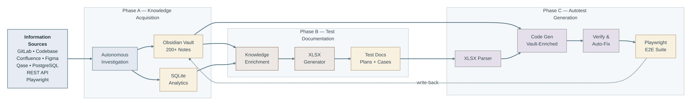
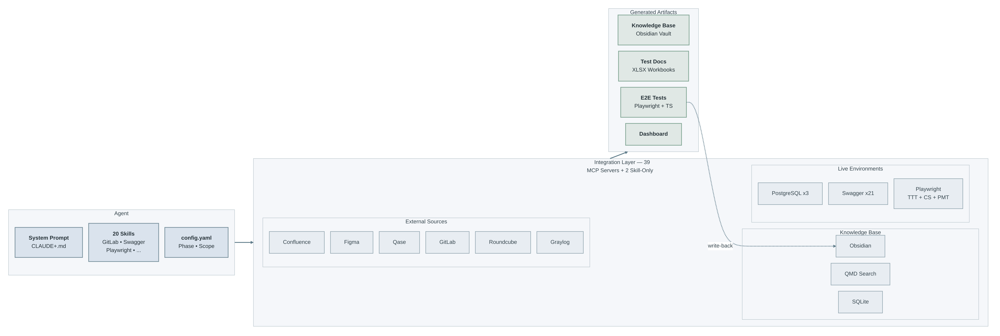

# AI-Driven QA Automation Expert System for TTT

## Summary

An autonomous AI expert system that systematically investigates the TTT application, builds a structured knowledge base, and generates test documentation (XLSX) with executable Playwright E2E autotests — replacing months of manual QA analysis with a repeatable, self-improving pipeline.

**Repository:** https://github.com/midas44/ttt-expert-v2

## Problem

TTT is a large legacy application (4 microservices, 268 API endpoints, 86 database tables, React frontend with 12 modules) with insufficient test coverage and significant undocumented business logic. Manual investigation and test case writing for a system of this scale requires months of QA effort, and the results quickly become outdated as the application evolves.

## Solution

An AI agent (Claude Code + Claude Opus) that autonomously executes a three-phase pipeline:

*Fig. 1 — Three-phase pipeline: Sources → Knowledge Acquisition → Test Documentation → Autotest Generation*

### Phase A — Knowledge Acquisition

The agent conducts multi-session investigation across all available information sources: codebase static analysis, live environment testing (browser automation, REST API calls, database queries), external documentation (Confluence, Figma, Qase), and GitLab ticket mining (descriptions, comments, bug patterns). Findings are persisted into a structured knowledge base — an Obsidian vault with semantic search and a SQLite analytics database.

### Phase B — Test Documentation Generation

Using the accumulated knowledge, the agent generates per-module XLSX workbooks containing structured test plans and test cases. Each workbook is self-contained with cross-linked tabs (Plan Overview, Feature Matrix, Risk Assessment, Test Suites). Test steps are written as UI-first browser actions, with setup/cleanup steps for data preconditions.

### Phase C — Autotest Generation

Test cases from XLSX are parsed into a JSON manifest and enriched with vault knowledge (selectors, validation rules, edge cases). The agent generates executable Playwright + TypeScript E2E specs following a 5-layer framework (specs, fixtures, page objects, config/data, Playwright API). Tests are verified against live environments, failures are auto-diagnosed and fixed, and all findings are written back to the knowledge base.

## Architecture

*Fig. 2 — System layers: Agent → Integration Layer (39 MCP servers + 2 skill-only) → Generated Artifacts*

The system is built on Claude Code CLI with full autonomy mode, orchestrated by a bash session runner. It integrates with the target application through 39 MCP (Model Context Protocol) servers providing access to:

- **3 PostgreSQL databases** (dev, test, stage environments)
- **21 Swagger API instances** (3 environments x 7 service groups)
- **Playwright browser automation** (with VPN proxy bypass)
- **Confluence, Figma, Qase, GitLab** (documentation and requirements)
- **Obsidian + QMD semantic search** (knowledge base CRUD and retrieval)
- **SQLite** (analytics and tracking)

20 reusable skills encapsulate domain-specific interaction patterns for each integration. Two of those skills — **Roundcube** (shared QA mailbox) and **Graylog** (TTT backend log streams, one per environment) — cover REST-only surfaces that do not expose an MCP server, and provide notification-email and backend-log evidence respectively.

## Integrated Systems

The expert system covers three systems:

- **TTT** — the Time Tracking Tool itself (primary SUT). Full investigation surface: UI, REST API, database, logs, email, documentation.
- **Company Staff (CS)** — internal corporate tool; source-of-truth for employees and salary offices, one-way sync into TTT. Secondary SUT; UI-only access.
- **PM Tool (PMT)** — internal corporate tool; source-of-truth for project records, one-way sync into TTT. Secondary SUT; UI-only access.

Cross-project E2E scenarios — e.g. "edit a Salary Office on CS → verify the synced state on TTT", "create a new project on PMT → verify it becomes assignable on TTT" — are first-class test cases. The framework is generalized so that a further integrated system needs only a config directory plus per-project page-object and fixture slots; no further framework restructure is required.

## Key Innovation: Living Knowledge Base

The central innovation is the **knowledge base** — not a static snapshot, but a living, queryable resource that grows with every session:

- **Obsidian Vault** — 200+ interconnected markdown notes with YAML frontmatter, wikilink cross-references, and semantic search. Covers architecture, module deep-dives, API behavior, UI flows, data patterns, bug investigations, and ticket findings.
- **SQLite Analytics** — structured tables tracking exploration findings, module health scores, design issues, and test case coverage.
- **Bidirectional enrichment** — Phase C (autotest generation) discovers new information (selectors, timing quirks, data patterns) and writes it back to the vault, making subsequent test generation more accurate.

This knowledge base transforms the expert system from a one-shot generator into a **self-improving system** — each phase enriches the knowledge that feeds the next.

## Usage Scenarios

### Scenario 1: Full Module Coverage

Set `scope: "day-off"` in config and run all three phases. The system investigates the day-off module across all sources, generates comprehensive test documentation, and produces a complete Playwright E2E test suite. Typical result: 100+ test cases across 8+ test suites, with 85-90% autotest verification rate.

### Scenario 2: Targeted Ticket Testing

Set `scope: "3404"` (a GitLab ticket number) and the system focuses on that specific issue — reads the ticket and all comments, identifies the affected module, investigates the bug or feature, generates focused regression tests, and produces executable autotests. Typical result: 20-30 targeted test cases covering the exact scenario, edge cases from ticket comments, and related regression paths.

### Scenario 3: Interactive Expert Consultation

Run `claude` in the project directory and ask questions. The agent leverages the full knowledge base to answer questions about the application's behavior, trace business workflows, explain undocumented logic, or investigate specific bugs — without running the autonomous pipeline.

### Scenario 4: Incremental Updates

After a new sprint or release, the system can be re-run with updated scope to investigate changes, update affected vault notes, regenerate test documentation for modified areas, and produce new autotests — maintaining test coverage as the application evolves.

## Benefits

- **Speed** — full pipeline (investigation + documentation + autotests) completes in hours instead of weeks/months of manual QA effort
- **Depth** — systematic investigation covers areas that manual analysis often misses (ticket comment edge cases, cross-service interactions, implicit validation rules)
- **Consistency** — every test case follows the same format, every autotest follows the same architecture, every finding is structured and queryable
- **Reproducibility** — the knowledge base and generated artifacts are version-controlled; the pipeline can be re-run with different scope or after application changes
- **Self-improvement** — the knowledge base grows with every session, making each subsequent run more accurate and comprehensive
- **Cost-effective** — the full pipeline runs at a fraction of the cost of equivalent manual QA effort, with higher coverage and traceability

## Operating Modes

| Mode | Trigger | Output |
|------|---------|--------|
| **Autonomous Pipeline** | `./start.sh` | Knowledge base + XLSX docs + Playwright tests |
| **Interactive Expert** | `claude` in project dir | Answers, investigations, targeted tasks |
| **Scoped Execution** | `scope: "<module>"` or `scope: "<ticket#>"` | Focused artifacts for specific area |

## Technology Stack

- **AI Agent**: Claude Code CLI, Claude Opus model (full autonomy)
- **Knowledge Storage**: Obsidian vault + QMD semantic search + SQLite analytics
- **Integration**: 39 MCP servers (PostgreSQL, Swagger, Playwright, Confluence, Figma, Qase, GitLab)
- **Test Framework**: Playwright + TypeScript, 5-layer POM architecture
- **Orchestration**: Bash session runner with phase transitions, auto-stop, and dashboard
- **Documentation**: Python + openpyxl XLSX generation, Google Sheets compatible
